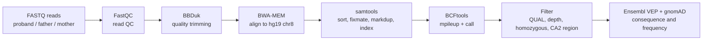

# NGS Variant-Calling Pipeline: Tracing a Child's Osteopetrosis to a Single Mutation in *CA2*


An end-to-end, reproducible short-read variant-calling pipeline, applied to a real published **trio exome** (proband, father, mother) from a consanguineous family in which the child has **osteopetrosis**. Raw FASTQ reads go in; a single, independently verified candidate variant comes out.


## Key result

| | |
|---|---|
| **Candidate variant** | `chr8:86,385,980 G>A` (hg19), *CA2*, **stop_gained**, p.Trp97Ter (protein truncated at residue 97 of 260) |
| **Proband genotype** | Homozygous, 100% variant reads, depth 64x, QUAL 225 |
| **Parents** | Both heterozygous carriers (father ≈ 44%, mother ≈ 58% variant reads) |
| **Population frequency** | gnomAD v2.1.1 allele frequency 0.000003978 (1 in 251,400 alleles), **0 homozygotes** |
| **Interpretation** | Consistent with autosomal recessive osteopetrosis with renal tubular acidosis (CA2 deficiency) |

> **Important:** this is a public teaching dataset based on a previously studied case. The goal was to independently and rigorously reproduce a diagnostic-style workflow, **not** to claim a new discovery. See [Limitations](#limitations).

## Contents

- [Background](#background)
- [Dataset](#dataset)
- [Pipeline overview](#pipeline-overview)
- [Results](#results)
- [Limitations](#limitations)
- [Repository layout](#repository-layout)
- [Reproducing the analysis](#reproducing-the-analysis)
- [QC screenshots](#qc-screenshots)
- [References and data sources](#references-and-data-sources)

## Background

Osteopetrosis is a rare inherited bone disease in which osteoclasts, the cells that resorb old bone, fail to work. Bone accumulates instead of being remodeled, so it is dense on imaging yet fragile, and can crowd out marrow and compress cranial nerves.

The parents are related and unaffected, which points to **autosomal recessive** inheritance: each parent silently carries one faulty copy of a shared gene, and the child inherited both. *CA2* (carbonic anhydrase II, 8q21.2) is a strong candidate because its loss causes osteopetrosis with renal tubular acidosis, reflecting its role in both osteoclasts and kidney tubule cells. Analysis was therefore scoped to chromosome 8.

## Dataset

Paired-end whole-exome reads for father, mother, and proband, plus an hg19 chr8 reference, from the Galaxy Training Network exome-sequencing tutorial (Zenodo record [3243160](https://zenodo.org/record/3243160)). The data are public, de-identified teaching material derived from a real clinical case.

## Pipeline overview



| Step | Script | Tool | Key parameters |
|---|---|---|---|
| 1. Download | `01_download_data.sh` | wget | Zenodo reads and UCSC hg19 chr8 reference |
| 2. Read QC | `02_qc.sh` | FastQC | default |
| 3. Trimming | `03_trim.sh` | BBDuk | `qtrim=r trimq=20 minlen=50` |
| 4. Alignment | `04_align.sh` | BWA-MEM | per-sample read groups |
| 5. BAM processing | `05_process_bam.sh` | samtools | sort, fixmate, markdup, index |
| 6. Variant calling | `06_call_variants.sh` | BCFtools | `mpileup` + `call -mv` |
| 7. Filter and annotate | `07_filter_annotate.sh` | BCFtools, VEP | QUAL >= 20, DP >= 10, `GT="AA"`, `chr8:86376236-86393722` |

Two verification steps were done on top of the scripted pipeline: the parents' aligned reads were checked at the exact variant position with `samtools mpileup`, and the proband's pileup was inspected manually with `samtools tview` to rule out a mapping artifact.

## Results

### Read processing and alignment (proband)

| Metric | Value |
|---|---|
| Raw reads (R1 + R2) | 4,785,108 (483,295,908 bases) |
| Removed by trimming | 517,160 reads (10.81%) |
| Reads after trimming | 4,267,948 |
| Mapped to chr8 | 99.98% |
| Properly paired | 99.75% |
| PCR duplicates flagged | 30.8% (typical for exome capture) |

FastQC showed clean reads with no adapter contamination, but per-base quality fell sharply in the last ~15-25 bp. Quality trimming resolved this, confirmed by a second FastQC pass.

### Filtering funnel

| Stage | Variants |
|---|---|
| Passing QUAL >= 20 and DP >= 10 | 4,716 |
| Homozygous alternate on chr8 | 1,930 |
| Inside the *CA2* region | 5 |
| Changing the protein (canonical transcript) | **1** |

### The five *CA2* candidates (VEP, canonical transcript ENST00000285379.5)

| Position (hg19) | Change | Consequence | Impact |
|---|---|---|---|
| **chr8:86,385,980** | **G>A** | **stop_gained (p.Trp97Ter)** | **HIGH** |
| chr8:86,386,697 | C>T | intron_variant | MODIFIER |
| chr8:86,388,228 | A>C | intron_variant | MODIFIER |
| chr8:86,389,403 | T>C | synonymous_variant | LOW |
| chr8:86,389,586 | A>C | intron_variant | MODIFIER |

Homozygosity alone is not informative in a consanguineous family: large stretches of the genome are identical by descent, so many harmless variants are homozygous too. Functional annotation is what separated the one meaningful candidate from four silent ones.

### Inheritance check at chr8:86,385,980

| Sample | Variant reads | Reference reads | Genotype |
|---|---|---|---|
| Father | ≈ 44% | ≈ 56% | Heterozygous carrier |
| Mother | ≈ 58% | ≈ 42% | Heterozygous carrier |
| Proband | 100% | 0% | Homozygous, affected |

Unaffected carrier parents and a homozygous affected child is the pattern expected for autosomal recessive inheritance, here demonstrated directly in the sequencing data rather than assumed from the pedigree.

## Limitations

- **Not a novel finding.** This is a known teaching dataset; the aim was methodological reproduction.
- **Chromosome 8 only**, for laptop-scale computation. No genome-wide analysis.
- **Single variant caller** (BCFtools), no cross-validation with a second caller such as GATK HaplotypeCaller, and no base quality score recalibration (BQSR).
- **No ClinVar entry found** for p.Trp97Ter among the catalogued pathogenic *CA2* variants checked. This is plausible for a private familial variant, but it means the call is a well-supported candidate, not an independently pre-confirmed pathogenic variant.
- **Parental allele fractions are approximate** (read counts at a single position).
- The pipeline does not establish pathogenicity. Clinical classification would require ACMG-style review and independent confirmation. **For research and educational use only.**

## Repository layout

```
NGS-Variant-Calling-Pipeline/
├── README.md
├── environment.yml          # Conda environment with pinned tool versions
├── scripts/                 # Numbered pipeline steps (01-07)
├── results/                 # Compact outputs suitable for version control
│   ├── bbduk_summary.txt
│   ├── flagstat_proband.txt
│   ├── proband_CA2_candidates.vcf
│   ├── vep_results.txt
│   └── screenshots/         # FastQC before/after charts
└── docs/index.html          # Single-file project website
```

Large data is intentionally **not** tracked by Git. By default the scripts read from and write to sibling folders next to this project: `raw_data/`, `trimmed/`, `aligned/`, `reference/`, `qc_reports/`, `variants/`. Set `DATA_ROOT` to use a different data directory.

## Reproducing the analysis

Run in Linux, WSL, or another Bash environment.

```bash
conda env create -f environment.yml
conda activate ngs-variant-calling
for script in scripts/0*.sh; do bash "$script"; done
```

Step 01 downloads the paired FASTQ files and the hg19 chr8 reference if they are not already present (existing files are never overwritten). Steps 01-06 produce QC reports, trimmed reads, processed BAMs, and a proband VCF. Step 07 applies the filters above and runs VEP when an offline cache is available.

| Variable | Purpose | Default |
|---|---|---|
| `THREADS` | Parallel threads for alignment and BAM steps | `4` |
| `DATA_ROOT` | Directory holding `raw_data/`, `trimmed/`, `aligned/`, `reference/` | sibling folders of this project |
| `VEP_CACHE_DIR` | Offline VEP cache location (enables annotation in step 07) | unset |
| `VEP_CACHE_VERSION` | Override the default VEP cache version | script default |

Note: the existing raw reads are uncompressed `.fq` files, so the trimming script uses those paths. The download step stores the Zenodo `.fq.gz` files and expands them to the same `.fq` names.

## QC screenshots

The [QC screenshot gallery](results/screenshots/README.md) walks through the proband's per-base read quality before and after trimming (R1 and R2). These are aggregate QC plots, not reads or alignments.

## References and data sources

- Galaxy Training Network, exome sequencing analysis tutorial dataset, Zenodo record [3243160](https://zenodo.org/record/3243160)
- Ensembl Variant Effect Predictor (VEP), GRCh37
- gnomAD v2.1.1, Broad Institute
- Tools: FastQC, BBMap/BBDuk, BWA-MEM, samtools, BCFtools

## Author

**Ranak**, B.Tech Biotechnology (3rd year), Haldia Institute of Technology, West Bengal, India.
