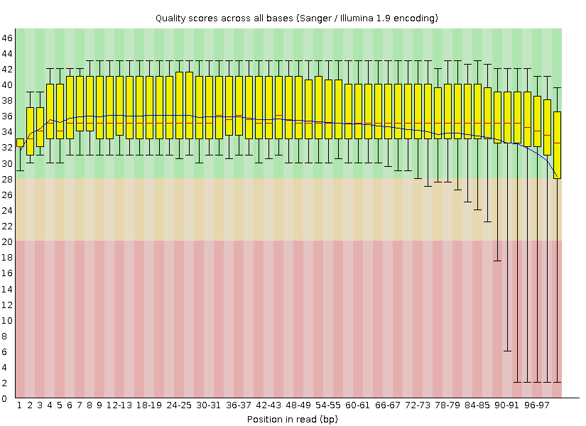
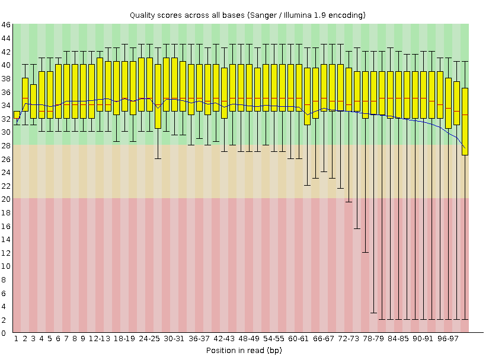
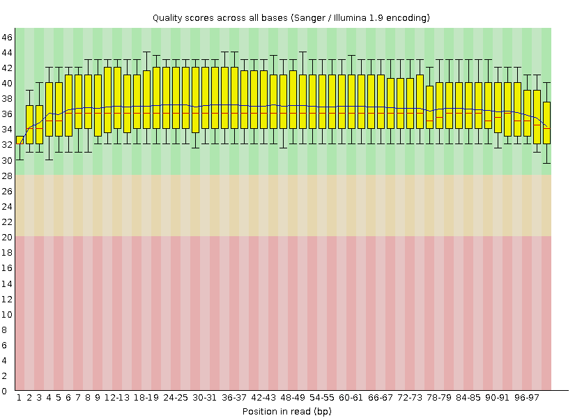
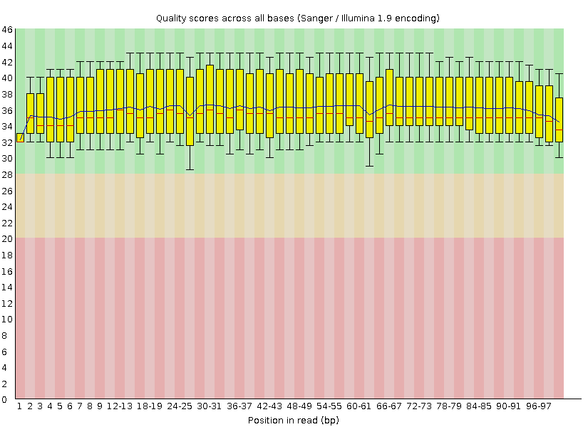

# Read QC Screenshots

These FastQC per-base quality plots show the proband read pairs in workflow order. Compare each raw-read chart with its trimmed counterpart to see the quality profile before and after BBDuk trimming.

## 1. Raw reads

### Read 1

### Read 2

## 2. Trimmed reads

### Read 1

### Read 2

The charts are aggregate quality-control summaries. The raw and trimmed sequence files and alignment files are not included in this gallery.